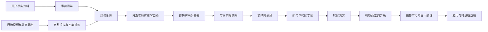

# 剪映语义自动剪辑（Jianying AutoEdit Agent）

面向 Windows 与剪映专业版的 Codex Skill。它会先理解素材和事实，再决定如何剪，而不是把整段视频直接套模板、统一变速或让口播迁就错误画面。

特别适合房产看房、空间导览、产品讲解，以及需要“事实准确、画面对应、口播自然”的竖屏视频。

## 它解决什么问题

普通自动剪辑常见的问题包括：房间识别错误、口播早于画面、遗漏餐厅、长走拍拖沓、进房动作被剪碎、字幕重复、结尾冻结，以及没有真正加入背景音乐。

本 Skill 把剪辑拆成可检查的事实层、场景层、口播层和执行层。只有完整看片并建立场景地图后，才生成最终口播和时间线蓝图。

## 核心能力

| 模块 | 能力 |
| --- | --- |
| 事实与证据分离 | 区分用户提供的面积、价格、交通等事实与视频真正可见的空间证据，不从画面臆造信息 |
| 完整看片 | 使用 FFprobe 获取媒体信息，并以固定间隔帧和场景变化帧覆盖整条素材 |
| 空间语义识别 | 识别玄关、厨房、餐厅、客厅、露台、景观、卧室、卫生间、道路和转场 |
| 口播逐句对齐 | 为每句话记录对应场景、画面区间、口播起点、字幕起点和置信度 |
| 连续走拍节奏 | 保留空间关系和进房动作，只压缩没有信息的等待、重复和走空段 |
| 剪映执行 | 按蓝图搭建多个独立片段，生成或导入配音，并读回时间线确认实际写入成功 |
| 智能字幕包装 | 使用剪映智能字幕，修正专名和数字后调用“文本 → 智能包装”，并删除重复的旧字幕层 |
| BGM 轮换 | 从剪映音乐库选择适合主题的纯音乐，记录历史并尽量避免连续视频重复用曲 |
| 导出审片 | 检查声画匹配、字幕、BGM、画幅、音视频流和结尾，发现问题后返回草稿修复 |

## 三种工作模式

### 1. 基本资料＋视频素材

用户只需提供楼盘、面积、户型、空间卖点、景观、交通、价格和必说/禁说内容等零散事实。Skill 会先完整看片，再按真实走访顺序和每个空间的有效画面长度重新组织口播。

### 2. 完整口播稿＋视频素材

原稿被视为事实和表达偏好来源，而不是不可改变的时间线。除非用户标记“必须原句保留”，否则可以重新排序、拆句和精简，使厨房、餐厅、客厅、露台、次卧、卫生间、主卧等介绍准确落在对应画面上。

### 3. 已有剪映草稿审查修正

检查现有时间线的场景顺序、片段节奏、字幕抢跑或重复、BGM 缺失、结尾冻结和声画错配。重大调整前保留原草稿并建立新版本。

## 房产视频标准流程



## 默认约定

- 房产视频未另行指定时沿用源素材的竖屏 `9:16` 画幅。
- 默认使用剪映年轻男声“小帅”和自然、清楚的房产介绍语气。
- 默认从剪映音乐库选择不过度抢声的纯音乐，并尽量避免与近期项目重复。
- 原素材不修改；已有草稿先保存和备份。
- “主卧”“卫生间”等具名口播和字幕必须等对应空间清楚出现后再开始。
- 实际拍到的餐厅/餐区必须单独识别，不能并入客厅后遗漏。

## 安装

在 Codex 新任务中输入：

```text
$skill-installer 请从 https://github.com/iamcrisiloveyoutoo-commits/jianying-autoedit-agent 安装这个 Skill
```

安装完成后，在下一轮任务中使用：

```text
$jianying-autoedit-agent
```

如果技能没有立即出现，请重新启动 Codex。Codex 的 Skill 结构和调用方式可参考 [OpenAI 官方 Skills 文档](https://learn.chatgpt.com/docs/build-skills)。

## 首次使用示例

只有基本资料和视频：

```text
使用 $jianying-autoedit-agent 剪辑这条房产视频。先完整看片并建立真实场景顺序，再根据我提供的房屋资料重写口播；使用竖屏、小帅男声、智能字幕包装和剪映纯音乐，最后完整审片并导出。
```

已有完整稿：

```text
使用 $jianying-autoedit-agent，把这份介绍稿作为事实与表达偏好来源。根据视频里实际出现的房间顺序重新拆句和对齐，不要让具名字幕早于对应画面。
```

检查已有草稿：

```text
使用 $jianying-autoedit-agent 审查当前剪映草稿，重点检查场景与口播、重复字幕、背景音乐、连续走拍和结尾是否冻结；保留原草稿并修正后重新导出。
```

## 运行依赖

| 依赖 | 用途 |
| --- | --- |
| Windows | 当前剪映自动化工作流的目标系统 |
| Codex 桌面端、CLI 或 IDE 扩展 | 加载和调用 Skill |
| 剪映专业版 | 时间线、配音、智能字幕、智能包装、曲库和导出 |
| FFmpeg / FFprobe | 读取媒体元数据、密集抽帧和导出验证 |
| PowerShell | 运行素材审查脚本 |
| Python 3 | 记录和检查 BGM 使用历史 |

## 输出与中间文件

典型工作流会生成：

- `property-facts.json`：用户事实清单。
- `scene-map.csv`：带源入点/出点和可见证据的场景地图。
- `edit-blueprint.json` / `edit-blueprint.md`：剪辑蓝图。
- `narration-alignment.csv`：逐句口播、画面和字幕对齐表。
- 最终成片和可继续编辑的剪映草稿备份。

这些项目文件不会包含在本仓库中。

## 使用限制与安全边界

- Skill 不会从画面猜测楼盘、面积、楼层、交通、价格或其他不可见事实。
- 资料提到某个空间，不代表视频一定拍到了该空间；缺失画面不会由无关室内镜头冒充。
- 交通信息可以使用用户提供并授权的道路素材；其他缺失内容应克制表达或省略。
- “小帅”、智能包装和剪映音乐库的具体可用性取决于剪映版本、账号、会员状态和地区；不可用时选择最接近的可用方案并如实说明。
- 本仓库不包含、不下载也不分发剪映曲库音乐。使用者需自行确认素材、音乐和成片的使用权。
- 登录、付费、验证码和账号安全步骤仍需账号持有人处理。

## 常见问题

### 为什么不能拿到视频就直接写最终口播？

因为资料顺序不一定等于真实走访顺序。先看片才能避免“主卧字幕已经出现，画面还在走廊”之类的错配。

### 为什么同时抽固定间隔帧和场景变化帧？

固定帧避免漏掉长镜头内部的空间变化，场景变化帧帮助定位开门、转身、进房和快速摇镜边界；两者结合才能形成可靠的源区间。

### 智能包装后为什么还会字幕重复？

剪映可能同时保留包装前的基础字幕和包装后的新字幕层。Skill 会检查并关闭旧基础字幕，同时保留智能包装自身的关键词强调层。

### 为什么不把整条视频统一变速？

统一变速会让房间展示和进房动作失去自然节奏。Skill 只压缩没有新信息的移动或等待区间，并将切点放在自然动作节点。

## 项目结构

```text
jianying-autoedit-agent/
├── SKILL.md
├── agents/
│   └── openai.yaml
├── references/
│   ├── jianying-build-and-audit.md
│   ├── music-rotation.md
│   └── scene-review-and-blueprint.md
├── scripts/
│   ├── music-history.py
│   └── prepare-scene-review.ps1
├── LICENSE
└── README.md
```

## 设计原则

- 事实先于文案。
- 画面顺序决定呈现时间。
- 声画对应优先于机械照读。
- 连续流畅优先于过度切碎。
- 可读字幕优先于复杂包装。
- 人声优先于背景音乐。
- 完整审片优先于“文件能播放”。

## License

[MIT](LICENSE)
